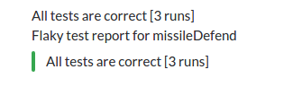
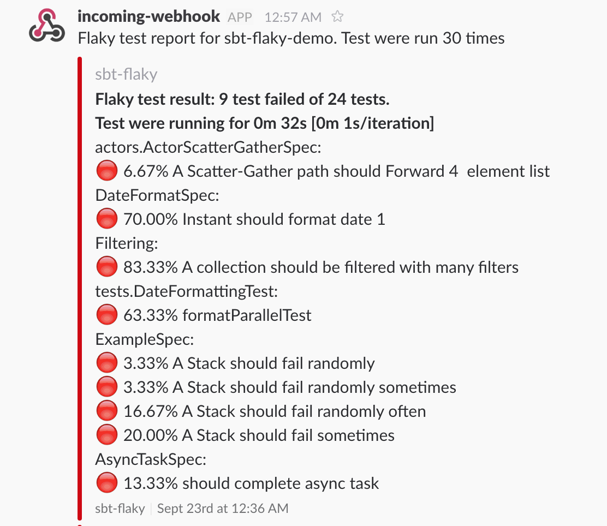
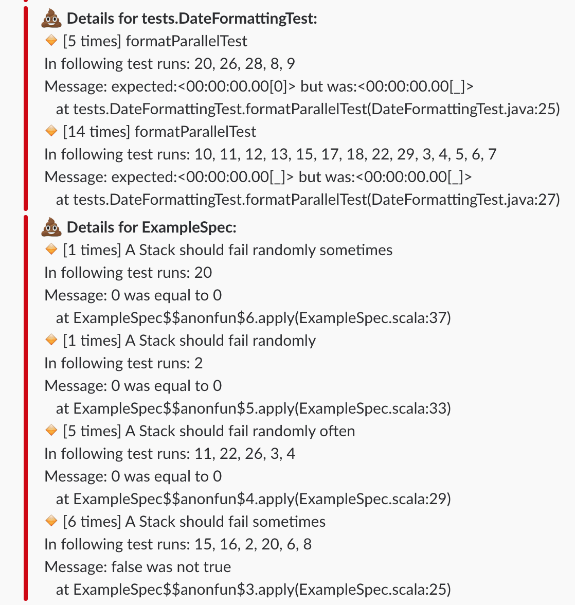

# Detecting flaky test with sbt

[](https://travis-ci.org/otrebski/sbt-flaky)

## Introduction
This project is proof of concept of flaky test detector SBT plugin. It can run test X times, for X minutes or until first failure.


## Installation
Example usages can be found in [demo project](https://github.com/otrebski/sbt-flaky-demo) or in [SBT scripted tests](https://github.com/otrebski/sbt-flaky/tree/master/src/sbt-test/sbt-flaky).

Add plugin to project configuration `project/plugins.sbt` or global configuration `~/.sbt/1.0/plugins/plugins.sbt`
```scala
addSbtPlugin("pl.otrebski" % "sbt-flaky" % "0.14")
```
Don't forget to enable plugin in `build.sbt`
```scala 
lazy val library = (project in file("."))
  .enablePlugins(FlakyPlugin)
```
## Versions
User version up to 0.12 for sbt 0.13. For sbt 1.0+ use plugin version 0.13+.

## How to run

Run tests 30 times:
```
sbt clean "flaky times=30"
```

Run tests 30 minutes:
```
sbt clean "flaky duration=30"
```


Run tests until first failure:
```
sbt clean "flaky firstFail"
```

## Sending reports to slack
To send report to Slack, set your Slack hook id as `flakySlackHook`. Boolean property `flakySlackDetailedReport` can be set true, to enable detailed report on slack. Property `flakyHtmlReportUrl` can be set to add link to HTML reports in slack report.   
For example if your slack hook is `https://hooks.slack.com/services/AAAAAAAAA/BBBBBBBBB/CCCCCCCCCCCCCCCCCCCCCCCC `, add following line to build.sbt:

```scala
flakySlackHook := Some("https://hooks.slack.com/services/AAAAAAAAA/BBBBBBBBB/CCCCCCCCCCCCCCCCCCCCCCCC )
flakySlackDetailedReport := true | false
flakyHtmlReportUrl := Some("http://my-ci-server.com/jobs/project/HTML_reports/")

```

## How it works.
Command `flaky` execute `test` task multiple times. After every test iteration, test results from `./target/test-reports` is moved to `./target/flaky-test-reports/<ITERATION>`. Test task is run for X times, for X minutes or until first failing test task. All tests results are used to calculate success ratio for every test.

## Reports

sbt-flaky can create plain text report (console and `target/flaky-test-reports/report.txt` file) and report send on Slack. Failures are grouped by stacktrace and differences between messages are replace by `_`. Example of failure message `Message: expected:<00:00:00.00[_]> but was:<00:00:00.00[_]>`

Html report is saved in `/target/flaky-test-reports-html/flaky-report.html`

### Example report on console

Currently only simple test report is printed:
```
[info]  Flaky tests result for  sbt-flaky-demo
[info] Healthy tests:
[info] formatNotParallelTest
[info] should write a lot of lines to file
[info] A Stack should throw NoSuchElementException if an empty stack is popped
[info] Instant should format date 2
[info] A ForwardingActor should Forwards in a chains of 100 and 105
[info] A Stack should pop values in last-in-first-out order
[info] A ForwardingActor should Forwards in a chains of 100 and 100 with expectMsgAllOf
[info] A ForwardingActor should Forward a message it receives
[info] should read a lot of lines from file
[info] A Scatter-Gather path should Forward 2 element list
[info] Instant should format date 3
[info] A Scatter-Gather path should Forward one element list
[info] A ForwardingActor should Forwards in a chains of 100 and 110
[info] A ForwardingActor should Forwards in chain of 100 actors
[info] A ForwardingActor should Forwards in a chains of 100 and 120
[info] 
[info] Flaky tests:
[info] A collection should be filtered with many filters 83.33%
[info] Instant should format date 1 70.00%
[info] formatParallelTest 63.33%
[info] A Stack should fail sometimes 20.00%
[info] A Stack should fail randomly often 16.67%
[info] should complete async task 13.33%
[info] A Scatter-Gather path should Forward 4  element list 6.67%
[info] A Stack should fail randomly sometimes 3.33%
[info] A Stack should fail randomly 3.33%
[info] 
[info] Details:
[info] 
[info]  actors.ActorScatterGatherSpec
[info]  [1 times] A Scatter-Gather path should Forward 4  element list
[info]    In following test runs: 5
[info]    Message: assertion failed: expected Joined(List(message 1, message 2, message 3, message 4)), found Joined(List(message 1, message 3, message 2, message 4))
[info]          at actors.ActorScatterGatherSpec$$anonfun$1$$anonfun$apply$mcV$sp$3$$anonfun$apply$3.apply(ActorScatterGatherSpec.scala:55)
[info]     
[info]  [1 times] A Scatter-Gather path should Forward 4  element list
[info]    In following test runs: 13
[info]    Message: assertion failed: timeout (149143826 nanoseconds) during expectMsg while waiting for Joined(List(message 1, message 2, message 3, message 4))
[info]          at actors.ActorScatterGatherSpec$$anonfun$1$$anonfun$apply$mcV$sp$3$$anonfun$apply$3.apply(ActorScatterGatherSpec.scala:55)
[info]     
[info] 
[info]            
[info]  DateFormatSpec
[info]  [21 times] Instant should format date 1
[info]    In following test runs: 1, 10, 11, 13, 16, 18, 19, 2, 20, 21, 23, 24, 25, 26, 27, 28, 29, 30, 6, 7, 9
[info]    Message: "____17-03-2_T22:57:__._____Z" was not equal to "____17-03-2_T22:57:__._____Z"
[info]          at DateFormatSpec$$anonfun$1$$anonfun$apply$mcV$sp$2.apply(DateFormatSpec.scala:17)
[info]     
[info] 
[info]            
[info]  Filtering
[info]  [25 times] A collection should be filtered with many filters
[info]    In following test runs: 1, 10, 11, 12, 14, 15, 16, 17, 18, 19, 2, 20, 21, 22, 23, 24, 26, 28, 29, 4, 5, 6, 7, 8, 9
[info]    Message: Futures timed out after [500 milliseconds]
[info]          at Filtering$$anonfun$3.apply(Filtering.scala:20)
[info]     
[info] 
[info]            
[info]  tests.DateFormattingTest
[info]  [5 times] formatParallelTest
[info]    In following test runs: 20, 26, 28, 8, 9
[info]    Message: expected:<00:00:00.00[0]> but was:<00:00:00.00[_]>
[info]          at tests.DateFormattingTest.formatParallelTest(DateFormattingTest.java:25)
[info]     
[info]  [14 times] formatParallelTest
[info]    In following test runs: 10, 11, 12, 13, 15, 17, 18, 22, 29, 3, 4, 5, 6, 7
[info]    Message: expected:<00:00:00.00[_]> but was:<00:00:00.00[_]>
[info]          at tests.DateFormattingTest.formatParallelTest(DateFormattingTest.java:27)
[info]     
........
```
### Example slack notification

Successful report example:



Failure report example:

Summary"


Details:



## History trends

Simple text and HTML report on history trends is supported.

Below is example of history report as text: 
```
[info] [info]  History trends:
[info] [info] New cases:
[info] [info] ExampleSpec.should fail sometimes Failure rate: 0.0%, 33.3%
[info] [info]
[info] [info] Improvement:
[info] [info] ExampleSpec.should fail randomly Failure rate: 50.0%, 33.3%
[info] [info]
[info] [info] No change:
[info] [info]
[info] [info]
[info] [info] Worse:
[info] [info] ExampleSpec.should fail randomly often Failure rate: 50.0%, 66.7%
[info] [info]
[info] [info]

```


History trends Html report is saved in `flaky-test-reports-html/flaky-report-history.html`

To enable history trends set `flakyHistoryDir` property in build.sbt with name of folder used to keep old reports. Currently 20 history results is kept. 
Example can be found [here](https://github.com/otrebski/sbt-flaky/blob/master/src/sbt-test/sbt-flaky/history/build.sbt)


## Backing up log files from every test run
To backup log files from every test run, specify list of files with property `flakyAdditionalFiles := List(new File("target/test.log")))` Example can be found here:

https://github.com/otrebski/sbt-flaky/blob/master/src/sbt-test/sbt-flaky/moveAdditionalFiles/build.sbt

## Reduce amount of console output
If project contains a lot of tests it can produce huge output if test is run multiple times. To reduce amount of output use `flakyLogLevelInTask` to change logger level when running flaky command.
```scala
flakyLogLevelInTask := sbt.Level.Info
or
flakyLogLevelInTask := sbt.Level.Error
```
Test classes and application can produce output to console. Consider changing log levels for tests.


## Known issues

If running a lot of tests for a many times you can get Out of memory error: `java.lang.OutOfMemoryError: Metaspace`. On report you will find flaky test `(It is not a test)`. Best options and good practice is to run Tests in separate JVM (fork). Details can be found in [sbt documentation](http://www.scala-sbt.org/0.13/docs/Forking.html)

The other cause of `(It is not a test)` on report is issue https://github.com/scalatest/scalatest/issues/780

## Example project
Checkout this [example project](https://github.com/otrebski/sbt-flaky-demo) 

# TODO
- [x] Run tests X times
- [x] Run tests for X minutes
- [x] Run test until first failure
- [x] Copy log file to run test iteration dir
- [x] Execute webhook after tests (slack)
- [x] Create SBT plugin
- [x] Select custom task to run insead of `Test`
- [ ] Disabling sending report to slack based on ENV variable (for running locally)
- [x] [Generating report HTML](https://github.com/otrebski/sbt-flaky/issues/9)
- [x] [Generating history report HTML](https://github.com/otrebski/sbt-flaky/issues/11)
- [ ] Select single test (or test class) to run (like testOnly task)
- [X] [Keeping track of history](https://github.com/otrebski/sbt-flaky/issues/7)
- [X] [Based on history show trends](https://github.com/otrebski/sbt-flaky/issues/7)
- [x] Use results only from last runs. Ignore junk dirs from other `flaky` run
- [x] [Suppress output from test](https://github.com/otrebski/sbt-flaky/issues/2) 
- [x] Display nice progress with ETA
- [ ] If project is using git, list changes since last run on report.
- [x] Add colors to console output


# Merge request are welcome !
 
